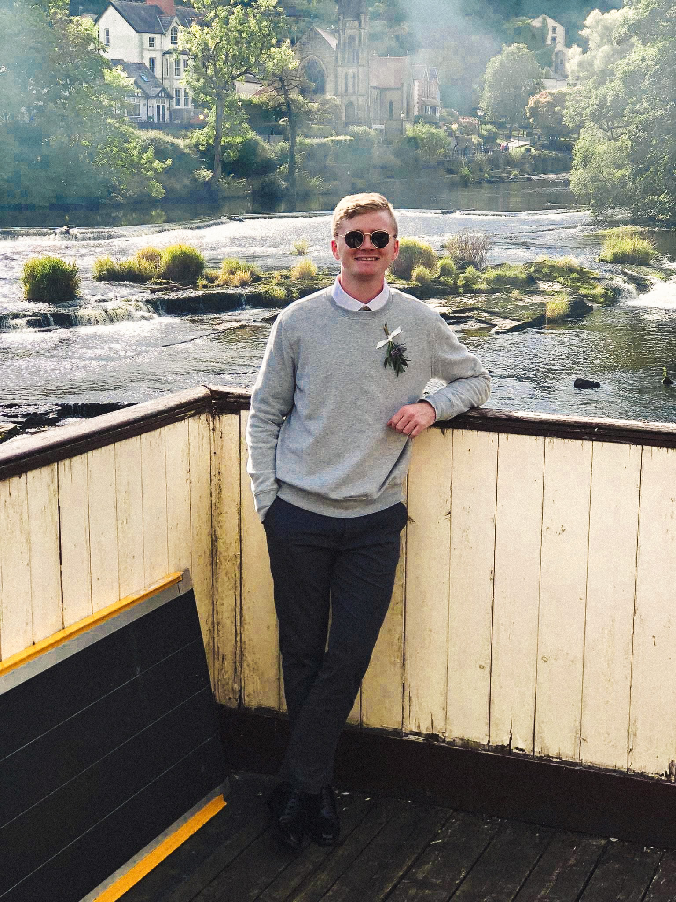

      

        
      

      

        <h4><b>
            About Me
        </b></h4>
        
Hello, my name is Tanner Patrom, I am currently a computer science graduate student at <a href="https://www.astate.edu/">Arkansas State University</a> where I aim to acquire a Masters in Computer Science with an emphasis in High Performance Computing. I have also worked at this University full time as a Network Technician for 3 years.

        
This website serves to showcase applications that I have built as well being a collection of notes from my studies at school and work.

      

    

---

## Areas of Interest
- High Performance Computing
- CPU Parallelism

